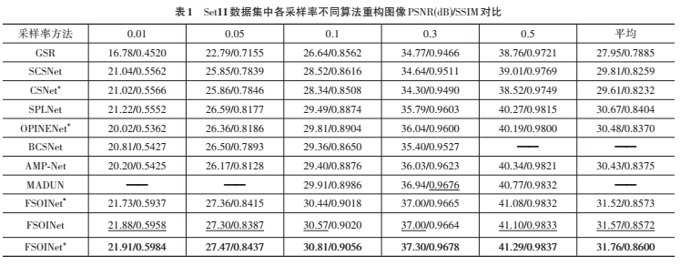

# 图像压缩感知的特征域优化及自注意力增强神经网络重构算法 [PyTorch]


## Datasets
For training,  we use 400 images from the training set and test set of the BSDS500 dataset. The training images are cropped to 89600 96*96 pixel sub-images with data augmentation. For testing, we utilize three widely-used benchmark datasets, including Set11, BSDS68 and Urban100.
Users can download the pre-processed training set from [GoogleDrive](https://drive.google.com/file/d/1hELlT70R56KIM0VFMAylmRZ5n2IuOxiz/view?usp=sharing). Training sets and test sets need to be placed under **./DataSets/**.

## Test
1. All models for our paper have been put in './save_temp'.
2. Run the following scripts to test FSOINET model.
    ```bash
    # test scripts
    python test.py  --sensing-rate 0.5 --test_name Set11 --group_num 100 --epochs 100
    ```
    ```bash
    # test scripts
    python test.py  --sensing-rate 0.1 --test_name Set11 --group_num 100 --epochs 40
    ```
3. Run the following scripts to test FSOINET+ model.
    ```bash
    # test scripts
    python test.py  --sensing-rate 0.5 --test_name Set11 --group_num 200 --epochs 100
    ```
    ```bash
    # test scripts
    python test.py  --sensing-rate 0.1 --test_name Set11 --group_num 200 --epochs 40
    ```
4. You can change the sensing-rate and test_name to to get test results for different sensing rates in different datasets.

## Train
1. Run the following scripts to train FSOINET model.
 ```bash
    # train scripts
    python train.py --sensing_rate 0.5 --layer_num 16 --learning_rate 2e-4 --group_num 100 --epochs 100 --batch_size 32
 ```
 ```bash
    # train scripts
    python train.py --sensing_rate 0.1 --layer_num 16 --learning_rate 2e-4 --group_num 100 --epochs 40 --batch_size 32
 ```
2. Run the following scripts to train FSOINET+ model.
 ```bash
    # train scripts
    python train_half.py --sensing_rate 0.5 --layer_num 16 --learning_rate 2e-4 --group_num 200 --epochs 100 --batch_size 6
 ```
 ```bash
    # train scripts
    python train_half.py --sensing_rate 0.1 --layer_num 16 --learning_rate 2e-4 --group_num 200 --epochs 40 --batch_size 6
 ```
3. You can change the sensing_rate to train models for different sensing rates and change the batch size if your GPUs have Sufficient memory.

## Results

### Quantitative Results



### Visual Results


## Citation
If you find the code helpful in your research or work, please cite our papers.
```
@article{陈文俊2022图像压缩感知的特征域优化及自注意力增强神经网络重构算法,
  title={图像压缩感知的特征域优化及自注意力增强神经网络重构算法},
  author={陈文俊 and 杨春玲},
  journal={电子学报},
  volume={50},
  number={11},
  pages={2629},
  year={2022}
}
```
or
```
@article{chen2022feature,
  title={Feature-Space Optimization-Inspired and Self-Attention Enhanced Neural Network Reconstruction Algorithm for Image Compressive Sensing},
  author={CHEN, Wen-jun and YANG, Chun-ling},
  journal={ACTA ELECTONICA SINICA},
  pages={1},
  year={2022}
}
```
